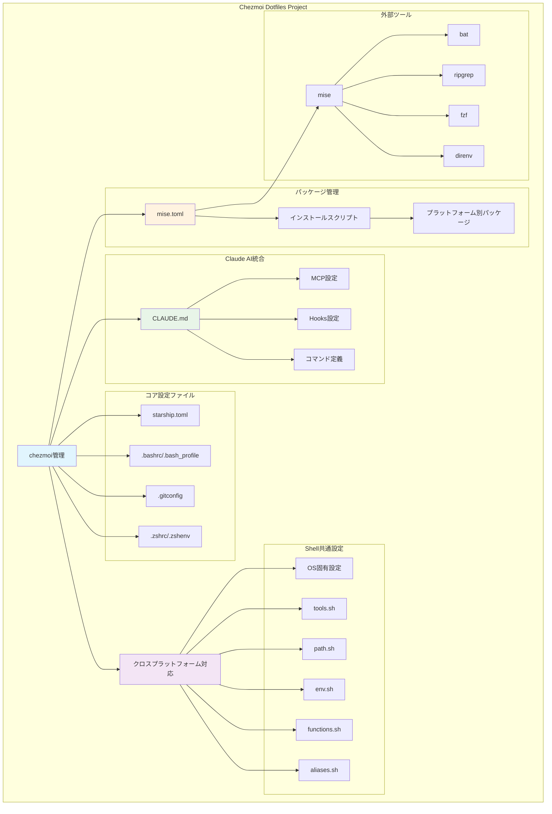
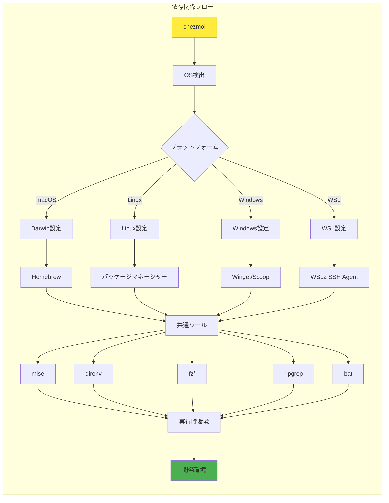
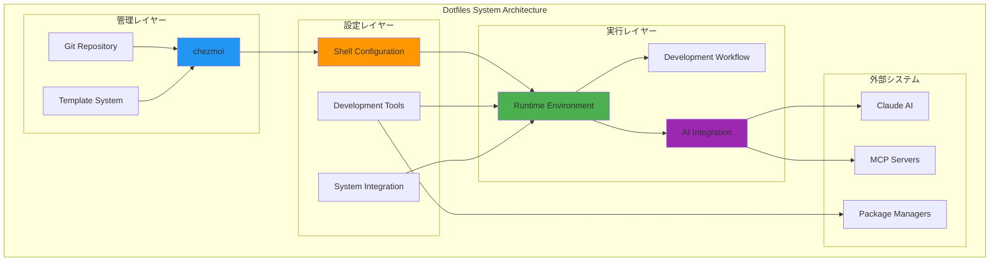

# プロジェクト可視化: Chezmoi Dotfiles

## プロジェクト概要

**Chezmoi Dotfiles Project** は、複数のプラットフォーム（macOS、Linux、Windows、WSL）で一貫した開発環境を提供するためのdotfiles管理システムです。

### 主要コンポーネント

1. **設定管理**: chezmoi によるテンプレートベースの設定管理
2. **Shell環境**: zsh/bash の共通設定とプラットフォーム別最適化
3. **開発ツール**: mise、direnv、fzf、ripgrep、bat の統合
4. **AI統合**: Claude AI との連携とMCPサーバー設定
5. **パッケージ管理**: プラットフォーム別の自動インストール

### 特徴

- **クロスプラットフォーム対応**: 単一の設定で複数OSをサポート
- **モジュラー設計**: 機能別に分離された設定ファイル
- **自動化**: パッケージインストールと環境セットアップの自動化
- **AI統合**: Claude AI との深い統合による開発効率化

## プロジェクトアーキテクチャ図



## 依存関係図



## システム構成図



## ディレクトリ構造

```
chezmoi/
├── README.md                   # プロジェクト説明
├── CONCEPT.md                  # 設計思想
├── PROJECT_VISUALIZATION.md   # このファイル
├── dot_claude/                 # Claude AI統合
│   ├── CLAUDE.md              # Claude設定
│   ├── commands/              # カスタムコマンド
│   ├── hooks/                 # フック設定
│   └── settings.json.tmpl     # 設定テンプレート
├── dot_shell_common/          # Shell共通設定
│   ├── aliases.sh             # エイリアス定義
│   ├── functions.sh           # 関数定義
│   ├── env.sh                 # 環境変数
│   ├── path.sh                # PATH設定
│   └── OS別設定ファイル
├── dot_zsh/                   # Zsh設定
├── private_dot_config/        # アプリケーション設定
├── scripts/                   # ユーティリティスクリプト
└── run_onchange_*.sh.tmpl     # インストールスクリプト
```

## 主要機能

### 1. クロスプラットフォーム対応
- macOS、Linux、Windows、WSL での統一環境
- プラットフォーム固有の最適化
- 条件分岐による設定の自動調整

### 2. Shell環境の最適化
- モジュラー設計による保守性
- パフォーマンス監視機能
- 履歴管理とFZF統合

### 3. 開発ツール統合
- mise による言語バージョン管理
- direnv による環境変数管理
- 検索・表示ツールの統合

### 4. AI統合
- Claude AI との深い統合
- カスタムコマンドの定義
- MCP サーバー設定

### 5. 自動化
- パッケージの自動インストール
- 設定の自動適用
- 環境セットアップの簡素化

## 使用技術

- **chezmoi**: dotfiles管理
- **Shell**: zsh/bash
- **Git**: バージョン管理
- **Templates**: 動的設定生成
- **Claude AI**: AI統合
- **MCP**: Model Context Protocol

このプロジェクトは開発者の生産性向上を目的とし、環境構築の手間を最小化しつつ、一貫性のある開発体験を提供します。