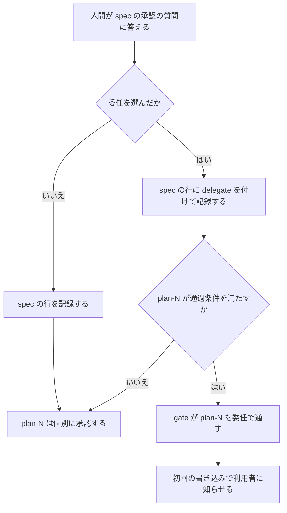

# Spec: spec 承認時の plan-N 事前委任

コードの参照は `home/dot_claude/` からの相対で書く。
`## Scope` のパスと `docs/` で始まるパスは、リポジトリの直下からの相対で書く。
調査は同じ dir の `research.md` にある。

## Goal

二層モードで、人間が spec を承認するときに「この spec の範囲に収まる plan-N は個別に承認しない」と選べるようにする。
選んだ場合、条件を満たす plan-N は人間の承認を待たずに実装へ進む。

## Experience Delta

変更前: spec を承認した後、plan-N を書くたびに承認の質問が出て、人間が答えるまで実装が止まる。
直近 7 日では 6 セッションで plan-N の承認が 10 回あった。

変更後: spec の承認の質問に「委任」の問いが並ぶ。
委任を選ぶと、spec の `## Scope` に収まる plan-N は、レビューを通った時点で実装に進む。
収まらない plan-N、保護対象のパスに触れる plan-N、委任を選ばなかった spec は、変更前と同じ動きをする。

## Architecture

委任は、spec.md の承認記録が持つ属性である。
plan-N には承認の記録を作らない。
gate は plan-N を 1 つの関数で分類し、その結果を書き込みの判定、診断、表示のすべてが読む。



### plan-N の分類

`classifyPlan` は plan-N を次の 3 つに分ける。

| 分類        | 条件                                                        |
| ----------- | ----------------------------------------------------------- |
| `approved`  | 人間の承認がある（現在の 6 条件と `parent-spec-hash` 一致） |
| `delegated` | 人間の承認は無いが、下の通過条件をすべて満たす              |
| `blocked`   | 上のどちらでもない。最初に満たさなかった条件を持つ          |

通過条件は次の 4 つである。

- spec.md が承認済みで、委任が有効である。`approvals.log` の spec.md の最終行に `delegate` があり、その hash が現在の spec.md の hash と一致する。
- plan-N が承認以外の gate 条件を満たす。Plan Status、Review Status、marker の verdict、marker の hash、`parent-spec-hash` の 5 つである。
- plan-N の `## Files` が 1 件以上あり、全件が spec の `## Scope` に収まる。
- plan-N の `## Files` に、保護対象のパスが 1 件も無い。

spec の hash が動くと、最終行の hash が一致しなくなる。
したがって委任は、spec の改訂で自動的に無効になる。

model は委任のために何も書かない。
plan-N の承認行は `pending` のまま残る。

### 保護対象のパス

次のパスは、Scope に書かれていても委任の対象にしない。
これらに触れる plan-N は個別承認に戻る。

| パス                                   | 理由                           |
| -------------------------------------- | ------------------------------ |
| `docs/decisions/` 以下                 | 設計の決定記録                 |
| `.claude` という名前の dir 以下        | hook、設定、規約の配置先       |
| `dot_claude` という名前の dir 以下     | 上の chezmoi での source       |
| `.skills/` 以下                        | model が従う手順書             |
| `CLAUDE.md`、`AGENTS.md`、`CONTEXT.md` | model が読んで従う指示と語彙   |
| `.github/workflows/` 以下              | 承認 gate の届かない CI の定義 |

リストは `hooks/lib/workflow-files.ts` の定数にする。
判定の規則は K4 に書く。
承認機構の実装がここに入るので、委任された plan-N は gate と recorder を書き換えられない。

この spec の plan-1 から plan-3 は、すべて保護対象のパスに触れる。
したがってこの変更自体は、委任を使わず個別に承認する。

## Alternative Approaches (Greenfield View)

### 差分最小案 (Incremental)

spec の承認記録に `delegate` を足し、gate が plan-N の承認 2 条件を飛ばす。
`## Scope` は足さない。
変更は `hooks/lib/workflow-approval.ts`、`hooks/lib/workflow-gate.ts`、質問の生成の 3 か所に収まる。

この案では、委任後の plan-N はリポジトリのどこにでも書ける。
plan-N が spec の範囲を超えていないかは、plan 層の reviewer 2 名の判断だけに依存する。

### 白紙設計案 (Greenfield)

承認の対象を文書の版ではなく「設計と、その影響範囲」にする。
人間は spec と、書き込みを許す範囲を承認する。
plan-N は実行の詳細として扱い、範囲に収まるかを機構が確かめる。
個別の承認は、範囲を超える plan-N にだけ求める。

この形になる理由は、人間の注意を向ける先にある。
ゼロから設計するなら、人間が判断するのは設計と影響範囲であり、タスクの並びではない。
機構が検査できるのはパスまでで、設計の良し悪しと、パスの中で何をするかは検査できない。
このため白紙でも、承認機構と決定記録は人間が見る側に残す。

範囲の表現には別の形もある。
spec が plan の枠（名前と Files の集合）を宣言し、plan-N がその枠と一致するかを見る形である。
この形は plan の件数と分け方まで縛れるが、spec の承認時に全 plan の Files を決める必要がある。
plan-N は spec の承認後に書くのが通常なので、パスの接頭辞を採る。

### 採用案と理由

白紙設計案の構造を、spec ごとに人間が選ぶ形で採用する。
既定は個別承認のまま変えない。

既定を変えない根拠は、誤りの費用の非対称である。
ADR-0011 は、設計判断を無人で実行する誤りは高くつくとしている（`docs/decisions/0011-autonomous-lane-charter.md:22`）。
同 ADR は、不要な承認待ちは摩擦で済むともしている。
委任は人間の確認を 1 つ手放すので、選ばなかった場合に確認が残る向きを既定にする。
plan-N の個別承認が問題を見つけた回数の記録は無く、既定を逆にする材料も無い。

差分最小案を採らない根拠は、依頼者の決定である。
依頼者は 2026-10-06 の質問で「spec の Scope で縛る」を選んだ。

## Scope

委任の実装が触れる範囲を、この spec が定める書式で書く。

```
home/dot_claude/hooks/lib/
home/dot_claude/hooks/cli/workflow.ts
home/dot_claude/hooks/implementations/document-workflow-guard.ts
home/dot_claude/hooks/implementations/approval-answer-recorder.ts
home/dot_claude/hooks/implementations/workflow-bash-sync.ts
home/dot_claude/hooks/tests/
home/dot_claude/templates/spec.md
home/dot_claude/rules/workflow.md
home/dot_claude/rules/autonomous-lane.md
.skills/document-workflow-reference/
docs/decisions/
CONTEXT.md
```

plan は 3 つに分ける見込みである。
plan-1 は記録と gate を扱う。
plan-2 は質問と通知を扱う。
plan-3 は文書と ADR を扱う。

## Key Decisions

- **K1: 委任は spec の承認記録の属性にする** — `approvals.log` の spec.md の行に `delegate: "plans-in-scope"` を足す。版は `v:1` のまま変えない。読み手は未知の項目を無視するので、古い読み手は委任なしとして動く。新しい読み手は `delegate` の値が `"plans-in-scope"` のときだけ委任として読む。委任の有効性は「最終行の hash = 現在の spec hash」で決まり、spec の改訂で無効になる。`ApprovalRecord` に `delegate` を足し、`readLatestApprovals` が最終行の値を返す。値が `"plans-in-scope"` 以外の行は、委任なしとして扱う。`delegate` 付きの行を書くのは K6 の記録経路だけである。
  - 参照: `hooks/lib/workflow-approval.ts:65-71`（`ApprovalRecord`）
  - 参照: `hooks/lib/workflow-approval.ts:135-155`（`parseRecord` は列挙した項目だけを取り出す）
  - 参照: `hooks/lib/workflow-gate.ts:138`（最終行の hash と現在の hash の比較）
- **K2: plan-N の判定は `classifyPlan` だけが行う** — `classifyPlan(planPath, ctx)` を `hooks/lib/workflow-gate.ts` へ足す。戻り値は Architecture の 3 分類である。`ctx` は spec の hash、委任の有効性、Scope の行を 1 回だけ解決したもので、`resolveSpecContext(wfDir, projectRoot)` が作る。この関数も gate に置く。委任の有効性は、spec.md が `isDocumentApproved` を満たすことを前提にする。台帳に古い `delegate` の行が同じ hash で残っていても、承認行が `pending` なら委任は無効である。`hooks/lib/workflow-files.ts` と `hooks/lib/workflow-audit-log.ts` から gate への参照は足さない。plan-N を評価する箇所は、すべてこの関数を呼ぶ。対象は 5 つある。`evaluateTarget`、`isImplementationPhase`、`summarizePlans`、`diagnoseGate`、`listApprovalCandidates` である。`listApprovalCandidates` は `delegated` の plan-N を候補から外す。`diagnoseGate` は `delegated` の plan-N に個別承認を案内しない。承認行や ledger を model のツール呼び出しで書く経路は足さない。ADR-0023 の deny はそのまま残る。
  - 参照: `hooks/lib/workflow-gate.ts:257-273`（判定と診断を同じ述語に寄せる方針と `isDocumentApproved`）
  - 参照: `hooks/lib/workflow-gate.ts:435-443`（`evaluateTarget` の plan-N 判定）
  - 参照: `hooks/lib/workflow-gate.ts:312-326`（`isImplementationPhase` の plan-N 判定）
  - 参照: `hooks/lib/workflow-gate.ts:537`（`summarizePlans`）
  - 参照: `hooks/lib/workflow-gate.ts:192`（`diagnoseGate` の個別承認の案内）
  - 参照: `hooks/lib/workflow-gate.ts:666`（`listApprovalCandidates`）
- **K3: 範囲は spec の `## Scope` で定める** — 書式は `## Files` と同じにする。コードブロックの中へ 1 行 1 パスで書く。解析は `parseFilesPaths` と同じ規則を `## Scope` に使う。末尾が `/` の行は dir を、それ以外の行はファイルを表す。次のどれかの行があれば、Scope 全体を無効とする。絶対パスの行。`~` で始まる行。`..` の区切りを含む行。`/` だけの行。`./` だけの行。行数は 16 までとし、超えたら Scope 全体を無効とする。この上限は、K6 の説明文に全行を出すためのものである。範囲の広さは制限しない（R2）。照合は `listsTarget` と同じ解決（worktree の toplevel からの相対と realpath）で行う。ファイルの行は realpath の完全一致、dir の行は「dir の realpath + `/`」での前方一致とする。これで `lib/` は `lib2/` に当たらない。plan-N の `## Files` に絶対パスか `~` の行があれば、その plan-N は Scope に収まらないとする。この照合は `hooks/lib/workflow-files.ts` に置く。関数は `planFilesWithinScope(planContent, specContent, projectRoot)` とする。Scope が無い spec、無効な spec、0 件の spec では、委任の問いを出さない。gate も委任を無効として扱う。
  - 参照: `hooks/lib/workflow-files.ts:20-45`（`parseFilesPaths`。空白を含むブロックは丸ごと捨てる）
  - 参照: `hooks/lib/workflow-files.ts:108-124`（`listsTarget`。完全一致の比較で、dir の照合は持たない）
  - 参照: `hooks/lib/document-hash.ts:74`（`## Scope` は既に design-hash の対象）
- **K4: 保護対象のパスを固定のリストにする** — Architecture の表のパスを `hooks/lib/workflow-files.ts` の定数にする。`classifyPlan` は、Files に保護対象が 1 件でもある plan-N を `delegated` にしない。Scope は model が書く値なので、質問の説明文で人間に見せるだけでは、承認機構の書き換えを止められない。判定は、K3 と同じ解決をした後のパスに対して行う。字面では判定しない。手順は次のとおりである。対象を `resolveWithMissingTail` で解決する。この関数は、存在する最も深い祖先を realpath にして、残りの要素を連結する。新規作成するファイルもこれで解決できる。次に worktree の toplevel からの相対パスにする。`/` で区切る。比較は大文字と小文字を区別しない。K3 の Scope の照合は大文字と小文字を区別するので、2 つは別の規則である。`docs/decisions`、`.skills`、`.github/workflows` は、先頭からの区切りが一致すれば保護対象とする。`.claude` と `dot_claude` は、ファイルのパスでは最後の要素を除くどの区切りに現れても保護対象とする。Scope の dir の行では、最後の要素も含めて見る。`CLAUDE.md`、`AGENTS.md`、`CONTEXT.md` は、最後の要素から末尾の `.tmpl` を外した名前が一致すれば保護対象とする。plan-N の Files の行は、ファイルを表す行として扱う。`resolveWithMissingTail` が解決できない行（途中の symlink が壊れている行など）がある plan-N は `blocked` とする。同じ判定を、plan-N の Files の各行と、K5 の off-plan の書き込み対象の両方に使う。`docs/decisions/` は `rules/autonomous-lane.md` の C3 が挙げる設計面である。`.github/workflows/` を入れる根拠は、CI に guard が届かないことである。残りは、model が読んで従う指示と、承認機構の実装の置き場である。
  - 参照: `docs/decisions/0011-autonomous-lane-charter.md:22`（CI には guard のバックストップが無い）
  - 参照: `hooks/implementations/document-workflow-guard.ts:959-962`（大文字と小文字を区別しない既存の比較）
  - 参照: `hooks/lib/path-containment.ts:113`（`resolveWithMissingTail`）
  - 参照: `hooks/lib/workflow-files.ts:53-57`（`isProseOnlyChange` が末尾の `.tmpl` を外す既存の処理）
  - 参照: `rules/autonomous-lane.md`（C3 設計面非接触）
  - 参照: `hooks/implementations/document-workflow-guard.ts:1005-1012`（`approvals.log` への書き込みの deny）
- **K5: 委任だけで実装フェーズに入った場合、off-plan の緩和を Scope の内側に限る** — 現状、実装フェーズではどの plan にも無いファイルへの書き込みが警告に緩む。この緩和は plan の Files に無いファイルが対象なので、K3 の Files の照合では止まらない。限定の対象は、`approved` の plan-N が 1 つも無く、`delegated` の plan-N だけで実装フェーズに入った場合である。この場合、off-plan の書き込みは Scope の内側で保護対象でないときだけ警告にする。それ以外は deny する。`approved` の plan-N が 1 つでもあれば、現状どおり警告にする。判定は gate が行う。`isImplementationPhase` は真偽を返す形のまま残す。根拠を返す関数 `implementationPhaseBasis` を足し、戻り値は `none` / `approved` / `delegated-only` とする。Scope の照合に projectRoot が要るので、両関数の引数に projectRoot を足す。`evaluateTarget` は `no-plan-owner` に、緩和してよいかを載せて返す。許可の戻り値には `basis`（`approved` / `delegated`）を足す。`delegated` のときは plan-N の名前、plan-N の hash、spec の hash も載せる。同じ対象を `approved` と `delegated` の plan-N が両方挙げた場合は、`approved` を採る。引数を変える呼び出し元は、guard と `workflow-bash-sync.ts` の 2 つである。guard はその結果を描画するだけにする。
  - 参照: `hooks/implementations/document-workflow-guard.ts:327-336`（off-plan の緩和）
  - 参照: `hooks/lib/workflow-gate.ts:446-450`（`no-plan-owner`）
  - 参照: `hooks/lib/workflow-gate.ts:289-293`（`isImplementationPhase` の引数）
  - 参照: `hooks/implementations/workflow-bash-sync.ts:121`（`isImplementationPhase` のもう 1 つの呼び出し元）
- **K6: 委任は承認の質問の 2 問目で選ぶ** — `workflow-cli ask-approval` は、候補に spec.md があり、その Scope が有効なときだけ、2 問目を出す。2 問目の文は `Document Workflow の承認` で始める。guard の「承認らしい質問」の判定が必ず当たる。2 問目は単一選択で、選択肢は「委任しない」「委任する」の順である。「委任する」の説明文には Scope の全行を入れる（K3 で 16 行まで）。保護対象に当たる行には「委任の対象外」と付ける。人間が見る範囲と、実際に委任が効く範囲を一致させるためである。全行が保護対象の spec では、2 問目を出さない。質問を生成する関数はファイルを読まず、判定済みの保護対象の行を引数で受け取る。質問の生成側と記録側は、K4 の同じ判定を呼ぶ。記録側は 2 問とも現状から作り直し、応答の `questions` 全体と完全に一致したときだけ記録する。委任は、1 問目で spec.md を選び、2 問目で「委任する」を選んだときだけ記録する。それ以外の組み合わせでは、選ばれた文書を委任なしで記録する。記録側は現在、質問が 1 つ、回答のキーが 1 つ、「承認しない」がちょうど 1 つであることを前提にしている。この 3 点を「1 問または 2 問」の形に作り直す。発話の経路（`承認 spec.md`）は委任を記録しない。予約したプロンプトで委任できる経路を作らないためである。
  - 参照: `hooks/lib/workflow-approval.ts:172`（`MAX_DOCS_PER_QUESTION`。1 問は 4 選択肢で埋まっている）
  - 参照: `hooks/lib/workflow-approval.ts:191`（`buildApprovalQuestions`）
  - 参照: `hooks/lib/workflow-approval.ts:229`（`isApprovalLikeQuestion`。質問のどれか 1 つが当たれば真）
  - 参照: `hooks/lib/workflow-approval-record.ts:172`（`extractDocNames`）
  - 参照: `hooks/lib/workflow-approval-record.ts:199`（`verifyAndRecordApprovalAnswer`）
- **K7: 委任で通した事実を、初回の書き込みで利用者へ知らせる** — 委任での通過は、人間が確認を手放した書き込みである。利用者は、その事実を後から追える必要がある。これは `rules/code-quality.md` の「Recoverable State Must Announce Itself」の適用ではない。同規約は害が見えた時点の信号を求めるもので、委任の正常な利用には当たらない。害に当たる Scope 外と保護対象への書き込みは、K5 の deny とその診断が知らせる。guard は、`delegated` の plan-N を根拠として書き込みを通す。その最初の 1 回で `systemMessage` の通知を出す。通知には plan-N の名前、hash の先頭 12 桁、K8 の取り消し方を入れる。同じ plan-N の同じ hash で 2 回目以降を出さないために、`<wfDir>/delegation-uses.log` に 1 行追記して読み戻す。書式は `off-plan-writes.log` と同じ TSV で、項目は `plan=`、`plan-hash=`、`spec-hash=`、`revoke=` とする。追記と読み戻しは `hooks/lib/workflow-audit-log.ts` に置き、既存の追記と共通の関数を使う。追記に失敗した場合は通知が重複することを許す。guard は、このファイルへのツールでの書き込みを `approvals.log` と同じ箇所で deny する。model が行を先に書いて通知を止めることを防ぐためである。`workflow-cli status` は、委任が有効かどうかと、各 plan-N の分類を表示する。
  - 参照: `hooks/implementations/document-workflow-guard.ts:119-122`（`context.json` の `systemMessage`）
  - 参照: `hooks/lib/workflow-audit-log.ts:50-62`（`appendOffPlanLog`）
  - 参照: `hooks/implementations/document-workflow-guard.ts:1005-1012`（ツールでの書き込みを deny する箇所）
  - 参照: `hooks/cli/workflow.ts:337`（`status`）
- **K8: 取り消しは既存の経路を使い、新しい発話を足さない** — spec.md の承認行を `pending` へ戻すと、spec は未承認になる。委任も無効になる。これは既存の取り消しの手順である。その後の承認の質問で「委任しない」を選べば、spec は委任なしで承認され、plan-N は個別承認に戻る。新しい取り消しの発話は足さない。`approvals.log` は最終行の hash で承認を決めるので、行を追記する経路を増やすと、その経路が承認を成立させる条件を満たす必要が生じるためである。
  - 参照: `hooks/lib/workflow-gate.ts:132-136`（承認行の判定）
  - 参照: `hooks/lib/workflow-approval.ts:130`（最終行が勝つ）
  - 参照: `hooks/implementations/approval-recorder.ts:93-95`（既存の発話が記録の前に確かめる条件）
- **K9: 既存の決定との関係を ADR-0028 に書く** — 新しい ADR-0028 を起こし、次の 3 点を記録する。ADR-0006 と ADR-0023 には ADR-0028 への参照を追記する。`rules/autonomous-lane.md` は、位置づけの節を明確化する。「自律実行」が system の起動する実行を指すことと、委任が pull レーンの承認の粒度であることを書く。
  - 委任で人間が手放すもの。実装前に plan-N の Files と Tasks を見る機会である。plan-N のレビュー結果は model が要約して書く値で、委任はこれを人間が受け入れる決定である。
  - ADR-0006 が継承案を退けた理由との関係。理由は、plan-N が自分の hash を持たなくなることによる波及だった。この設計は plan-N の marker の hash と `parent-spec-hash` を残す。一方で、spec の改訂は全 plan-N の委任を同時に無効にする。この波及は残る。
  - ADR-0011 と `rules/autonomous-lane.md` との関係。同規約は、ローカルの対話セッション内の自律実行を提供しないとし、実行時に trivial かどうかを判定する機構を禁じている。委任は人間が起動した作業の中で、人間が spec と範囲を承認して成立する。機構が判定するのはパスの包含で、変更が trivial かどうかではない。ただし同規約は「自律実行」を定義していない。人間の承認なしに plan-N が実装へ進む点は、文言の上で条項と緊張する。ADR-0028 はこの緊張を認めたうえで、上の区別を書く。
  - 参照: `docs/decisions/0006-document-workflow-two-layer.md:109`
  - 参照: `docs/decisions/0011-autonomous-lane-charter.md:22`
  - 参照: `rules/autonomous-lane.md`（位置づけの節と C1）

## Risks

- **R1**: plan-N の通過条件は、すべて model が満たせる。reviewer の起動は台帳で確かめるが、verdict は model が書く。→ 委任はこの点を人間が受け入れる決定として ADR-0028 に書く。影響は K3 から K5 で Scope の内側に限る。K7 の通知と記録で、事後に追える。
- **R2**: Scope に `home/` のような広い行を書くと、範囲の限定が弱くなる。→ K6 の説明文に Scope の全行を出し、人間が範囲を見て選べるようにする。承認機構と決定記録は K4 で常に除く。それ以外の広さの上限は機構で決めない。
- **R3**: Bash の書き込みは、対象を解析できた場合しか Scope と照合できない。→ 解析できない Bash は現状どおり deny される。K5 は Bash の対象にも同じ判定を使う。
- **R4**: 進行中のセッションの `approvals.log` には `delegate` が無い。→ 委任なしとして動くので、移行は要らない。hash の正規化は変えない。
- **R5**: 委任した後で、特定の plan-N だけ見たくなる。→ K8 の手順で全体を個別承認に戻す。plan-N ごとの取り消しは提供しない。
- **R6**: spec の文言を直すと、全 plan-N の委任が同時に無効になる。→ 人間が改訂後の spec を承認し直し、委任を選び直すと戻る。承認は 1 回で済むが、実装中の plan-N はその間止まる。この流れは plan-2 のテスト項目に入れる。
- **R8**: 人間が承認した plan-N が 1 つでもあると、off-plan の緩和は現状どおりになる。その状態では、委任の plan-N の実行中でも、Scope 外への off-plan 書き込みが警告で通る。→ これは現在の二層モードと同じ挙動で、委任が足す権限ではない。受容する。
- **R7**: 保護対象のリストは、リポジトリごとの設計面を拾えない。→ リストに無い設計面は、Scope に書かないことで守る。Scope は人間が承認時に全行を見る。

## Phase 1 で意図的に提供しない体験 (任意)

### 承認済みの spec への後からの委任

- **代替経路確認**: `hooks/lib/workflow-gate.ts:666`（`listApprovalCandidates` は承認済みの文書を候補にしない）。委任なしで承認した spec では、plan-N を `workflow-cli ask-approval` で個別に承認できる。K8 の手順で承認を取り消せば、委任を選び直せる。
- **非提供対象**: 承認済みで hash の変わっていない spec に、承認を取り消さずに委任だけを付ける操作。
- **将来の予定**: 委任の利用回数が `delegation-uses.log` に溜まってから判断する。

### 単層モード（plan.md）での委任

- **代替経路確認**: `hooks/lib/workflow-gate.ts:406-410`（単層は plan.md の承認だけで実装に進む）。単層には委任する先の文書が無い。
- **非提供対象**: plan.md の初回承認の省略。
- **将来の予定**: 提供しない。初回の承認は依頼者が対象外とした。

## ISO 25010 次元選択

- **セキュリティ**: 承認を人間に限る機構へ、通過の経路を 1 つ足す。model が委任を自分で成立させられないこと、Scope の外と保護対象へ書けないことを確かめる。
- **機能適合性**: 委任あり・なし、Scope 内・外、保護対象の有無、spec の改訂後の各組み合わせで、`classifyPlan` の分類が Architecture の表と一致することを確かめる。
- **信頼性**: `approvals.log` が読めない、Scope が無効、`parent-spec-hash` が無い場合に、分類が `blocked` になることを確かめる。
- **使用性**: 委任の問い、初回の通知、`workflow-cli status` の表示から、利用者が委任の状態と取り消し方を読み取れることを確かめる。
- **対象外**: 性能効率性（gate が読むファイルは増えない。spec.md と `approvals.log` は既に読んでいる）。移植性（OS に依存する処理を足さない）。

## Approval

- Plan Status: complete
- Review Status: pass
- Approval Status: approved

## Reviewer Outputs (Round 1)

### logic-validator

- verdict: needs-work
- 主指摘: K7 の取り消しは、現在の hash で行を追記するため、未レビューの spec 改訂を承認にしてしまう。K2 の置き換えが 2 か所では、承認候補の列挙と診断が gate と食い違う。

### scope-justification-reviewer

- verdict: needs-work
- 主指摘: K6 の記録と K7 に、オーダー達成に必要だという根拠が無い。`rules/autonomous-lane.md` の条項との関係と、spec 改訂で委任が全 plan-N に波及する点が書かれていない。

### decision-quality-reviewer

- verdict: needs-work
- 主指摘: 委任の範囲に承認機構の実装が入りうる。支配軸は安全機構の保全なのに、採用理由がテストの書き直しコストに寄っている。規模の縮小と通知の削減も提案（トリアージで除外）。

### greenfield-perspective-reviewer

- verdict: needs-work
- 主指摘: 承認機構と `docs/decisions/` を委任の対象外にする固定の保護リストが要る。承認の根拠を返す関数を 1 つにまとめるべき。

### architecture-boundary-analyzer

- verdict: needs-work
- 主指摘: plan-N の判定を 1 つの関数に置き、診断と `status` も同じ関数を読む形にする。Scope 外の拒否は gate が判定し、guard は通知と記録だけを持つ。

### security-vulnerability-analyzer

- verdict: needs-work
- 主指摘: K7 が承認の成立に使える。K5 の説明文が Scope の先頭 3 行しか見せない。Scope の照合で `..`・絶対パス・兄弟 dir の扱いが未定義。通知の記録を model が先に書くと通知が出なくなる。

<!-- auto-review: pending -->
<!-- intent-triage: pending -->

## Reviewer Outputs (Round 2)

### logic-validator

- verdict: pass
- 主指摘: 1 周目の 5 点は解消。保護対象の判定単位が一意でない。書き込みを許可する戻り値に、委任で通したことが載っていない。この spec 自身の Scope が行数の上限を超えている。

### scope-justification-reviewer

- verdict: pass
- 主指摘: 通知は「害が見えた時点で鳴らす」規約の条件に当たらず、根拠の引用が合わない。`rules/autonomous-lane.md` について「改訂は要らない」と「1 文足す」が矛盾する。

### decision-quality-reviewer

- verdict: pass
- 主指摘: 軸の取り違えは残っていない。通知の根拠は規約の引用ではなく、人間の確認を手放した事実を追えることに置く。`.skills/` と `CONTEXT.md` が保護対象に無い。行数の上限は範囲の広さを制限しない。

### greenfield-perspective-reviewer

- verdict: pass
- 主指摘: 作り直しになる箇所は無い。委任の質問の説明文で、保護対象の行へ印を付ける。承認済みの plan-N が混在する場合の off-plan の扱いを明記する。

### architecture-boundary-analyzer

- verdict: pass
- 主指摘: 依存方向は保たれる。書き込みを許可する戻り値に根拠と plan-N の情報を載せる。同じ対象を承認済みと委任の plan-N が挙げた場合は、承認済みを優先する。

### security-vulnerability-analyzer

- verdict: needs-work
- 主指摘: 保護対象の判定を、字面で行うか realpath で行うかが書かれていない。字面の判定は、symlink や大文字小文字の差で抜ける。判定は解決後のパスに対して行うと明記する。対象は Files の行と off-plan の書き込み先の両方である。

<!-- auto-review: verdict=needs-work; hash=61e4a69c5258967aef27294489e144073e9531dd4e7ccacd74a4008df5f13e41; design-hash=1d797f84295383ae8eb67e5a57f859e2b0a740f1debb0d6c768dbe0facd826f4; round=1; at=2026-10-06T04:04:53.342Z; reviewers=logic-validator+scope-justification-reviewer+decision-quality-reviewer+greenfield-perspective-reviewer+architecture-boundary-analyzer+security-vulnerability-analyzer -->

## Reviewer Outputs (Round 3)

Key Decisions を変えたため、差分ではなく全 6 名を再実行した。

### logic-validator

- verdict: pass
- 主指摘: 新規作成するファイルは realpath を取れず、通さない扱いになる。dir の行そのもの（`.claude/`）が保護対象の判定から外れる。

### security-vulnerability-analyzer

- verdict: pass
- 主指摘: Round 2 の 2 点は解消。保護対象のファイル名に `AGENTS.md` が無い。`.tmpl` 付きの名前が一致しない。

### scope-justification-reviewer

- verdict: pass
- 主指摘: Round 2 の 4 点は解消。`CONTEXT.md` を保護する根拠の書き方が、同ファイルの定義（語彙の参照）と合わない。

### decision-quality-reviewer

- verdict: pass
- 主指摘: 軸の取り違えは無い。説明文の印と保護対象の判定が同じ関数から出ることを plan-2 のテストに入れる。

### greenfield-perspective-reviewer

- verdict: pass
- 主指摘: Round 2 の 3 点は解消。保護対象の判定規則が 3 種類あるので、plan-1 のテストで代表のパスを表にして固定する。

### architecture-boundary-analyzer

- verdict: pass
- 主指摘: 依存方向は保たれる。質問の生成には、判定済みの保護対象の行を引数で渡す。生成側と記録側は同じ判定を呼ぶ。

<!-- auto-review: verdict=needs-work; hash=52e9d07ce9930f83e7a2d21af48659cadf2b665f0b7e156101096af331020a1b; design-hash=cba0e06c4c6e627777661e039dc532ea2ac4b89b2e2e1a6df769fd033fa7afa7; round=2; at=2026-10-06T04:09:15.177Z; reviewers=logic-validator+scope-justification-reviewer+decision-quality-reviewer+greenfield-perspective-reviewer+architecture-boundary-analyzer+security-vulnerability-analyzer -->

<!-- auto-review: verdict=pass; hash=aa725fce432b4962f1355381f0f885195b9f804a337aab50d3254fe8a89b2c95; design-hash=63279c8cea53d440effd8583f7f1a6a1ee8cdb770806b368fe164dc8d207a106; round=3; at=2026-10-06T04:11:57.277Z; reviewers=logic-validator+scope-justification-reviewer+decision-quality-reviewer+greenfield-perspective-reviewer+architecture-boundary-analyzer+security-vulnerability-analyzer -->
<!-- intent-triage: adopted=35; excluded=2; at=2026-10-06T04:11:57.294Z -->
